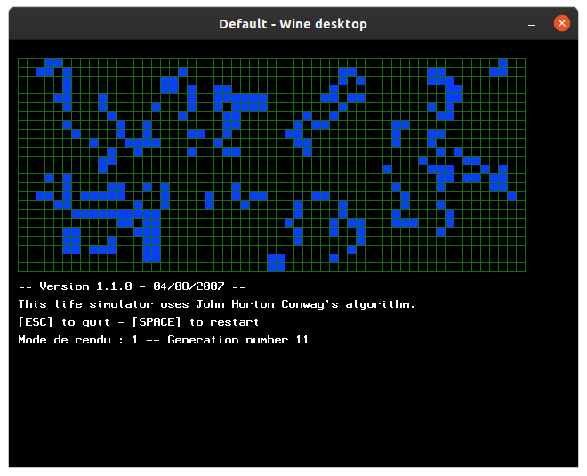

# lifesim
A life simulator based on John Horton Conway's algorithm.
## Presentation

## How to run it
If you are under Windows, simply run *lifesim01.exe*.
Linux users can try to use Wine, it works for me (that's how I took the screen captures): `wine ./lifesim01.exe`. You might have to run `winecfg`, go to the *Graphics* tab and tick *Emulate a virtual desktop*.
OS X users will have to download, install and setup the [BlitzMax compiler](https://blitzmax.org/downloads/).
